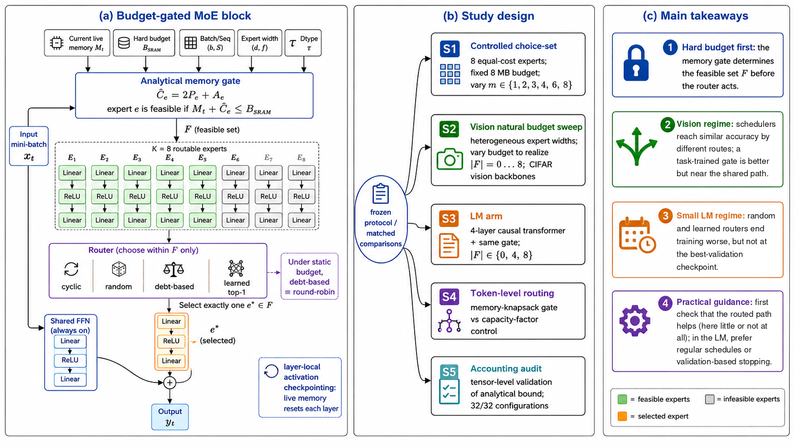

# When does router choice matter under hard activation-memory budgets?



*Figure 1. Overview of the study. The schematic was generated with OpenAI's ChatGPT and checked by the authors; the
takeaway text in (c) was revised to match the results.*

Code, configurations, the dated protocol, per-run results and analysis scripts for the paper
**"When Does Router Choice Matter under Hard Activation-Memory Budgets? A Controlled Feasibility-Set Study"**
(W. Jeong and H. Oh, 2026).

## In plain words

When a mixture-of-experts (MoE) model is trained on a device with little memory, a memory gate first decides which
experts fit the budget; the router then picks one of them. We tested, with about 2,200 training runs, whether that
pick matters. In vision, routers that pick differently on most steps showed no resolved accuracy difference (most
comparisons were statistically equivalent, the rest unresolved), and at this training length the routed experts added
little accuracy. In a small language model, random and learned routers ended training worse than round-robin, but not at
their best-validation checkpoints. Keeping training within the modeled memory budget is the gate's job, not the router's.

## Main results (exact numbers; the test is named in each line)

- **Controlled choice-set experiment** (eight equal-cost experts, fixed budget): no router comparison resolves a
  difference in any cell; 35 of 45 genuine cell-pairs (77.8%) are equivalent within ±0.5 percentage points
  (paired TOST, Holm-corrected within each grid and router pair).
- **Natural budget sweeps** (|F| = 0 to 8, two vision backbones): zero resolved differences; 105 of 165 genuine pairs
  (63.6%) equivalent (same test), although routers disagree on 49.8–87.8% of routing decisions.
- **Task-trained router** (CIFAR-100): +0.55 pp at |F| = 4 and +0.90 pp at |F| = 8 over round-robin (paired t-test,
  Holm p = 0.023 and p < 10^-4), but its mean final accuracy is within 0.13 pp of the shared path alone (post hoc). A dense all-experts ceiling
  (budget ignored, modeled peak 2.4x the budget) adds 3.8 pp over the shared path (Holm p < 10^-11).
- **Small language model** (d = 128, all experts feasible): learned top-1 ends training +47.9 perplexity (+25.1%) worse
  than round-robin (10/10 seeds; paired t-test, Holm p < 10^-4), but not at the best-validation checkpoint
  (−3.3, unadjusted p = 0.056).
- **Token-level routing**: a greedy memory-knapsack gate stays within the modeled budget in 30/30 runs; no capacity
  factor can comply below a computable budget once every expert receives tokens (the tuned control peaked at
  13,186 KB, 2.2x and 1.6x the two lower budgets).
- **Memory accounting**: saved-tensor storage plus parameters and gradients of isolated expert blocks stays below the
  analytical bound in 32/32 configurations (framework-level measurement).

## Limitations

- Small models (0.37M–3.0M-parameter vision backbones; a 4-layer WikiText-2 transformer), eight experts, one routed
  expert per layer and step, and simulated budgets under a stated accounting model (layer-local checkpointing is
  assumed, not implemented). No microcontroller executes training here.
- The main learned routers are balance-trained; the task-trained variant ran in four cells, and no gated round-robin,
  scale-matched or longer-training control was run, so why it helps is untested.
- Seeds were extended sequentially at a pre-declared gate; all p-values are nominal. With the first five seeds only,
  6 of 210 genuine vision pairs pass the equivalence test.
- The language-model effect is a final-epoch effect in an overfitting regime; it attenuates at d = 256.

## License

MIT (see `LICENSE`). Datasets: CIFAR-10/100 (Krizhevsky, 2009) and WikiText-2 (Merity et al., 2017) are downloaded by
the scripts and are not redistributed here.

---

## Reproduction guide

This repository holds the code, the frozen experimental protocol, the frozen
aggregation tables and the per-run artifacts behind the paper's tables and
figures. All paths are relative to this directory. Run every command from this
directory.

## Directory map

```
README.md                  this file
PROTOCOL_frozen.md         frozen experimental protocol (S0) + Amendments 3, 4 and 5
                           (the code comments cite it as PROTOCOL.md)
gatedmoe/                  the Python package (models, memory gate, routers,
                           debt schedulers, vision + LM training loops)
requirements.txt           pinned package versions of the run environment
test/                      unit and regression tests (pytest; need torch)
scripts/                   study scripts: grid design, queue runner, single-run
                           entry points, analysis, figures
configs/                   base.yaml + frozen job lists (*_grid.json)
result/frozen_2026-08-24/  frozen vision tables (primary endpoint), route
                           disagreement, E3 memory output; its lm_summary.csv and
                           lm_curves.csv come from the superseded e6lm2_ grid
result/tables/             numbers_v11.csv, extras_v11.csv, equivalence_secondary.csv,
                           equiv_categories.csv
result/tables/lm_v11/      LM tables of the paper (corrected grids e6lm3_/e6lm3d256_)
result/tables/lm_v11_superseded_e6lm2/   the same analysis on the superseded grids
result/tables/superseded_v10/            earlier LM tables (see its README.md)
result/tables/a5/          Amendment 5 tables (task-trained router, dense ceiling,
                           build check)
result/tables/v13/         post hoc sensitivity tables (first five seeds,
                           Debt-Base pairs removed, accuracy by |F|, LM seed
                           modes, LM sign and Wilcoxon tests)
result/tables/v14/         run inventory over every prefix; post hoc context
                           tests (task-trained router vs shared path alone;
                           p-values of the round-robin differences by |F|)
result/e3_measured_memory.json   E3 memory-validation output (copy of the frozen one)
result/logs/<run>/         per-run artifacts, 2,463 run directories (see below)
```

## Code labels and paper names

| code label             | name in the paper                                      |
|------------------------|--------------------------------------------------------|
| round_robin            | round-robin                                            |
| gatedmoe_base          | Debt-Base                                              |
| gatedmoe_g             | Debt-Grad                                              |
| learned_top1           | learned top-1                                          |
| learned_top1_aux0      | learned top-1 without auxiliary loss                   |
| gated_top1             | task-trained (gate-weighted) top-1, Amendment 5        |
| dense                  | dense ceiling (all experts, no budget), Amendment 5    |
| random                 | i.i.d. random                                          |
| fixed_cadence_random   | fixed-cadence random (cadence intervention)            |
| cycle_shuffle          | cycle-shuffled permutation                             |
| token_knapsack         | token-level knapsack gate                              |
| token_capacity         | token-level capacity-factor control                    |

## Amendment 4 (corrected LM evaluation)

An audit of the LM code path found two evaluation defects:

1. LM evaluation did not advance the evaluation copy of the debt counters.
2. LM evaluation changed the schedule state of the fixed-cadence and
   cycle-shuffle routers, and so their later training routes.

It also found that the logged `train_ppl` of learned arms included the
balancing penalty. The fixed `gatedmoe/lm_train_loop.py` snapshots and
restores every router's state during evaluation and steps the evaluation debt
copy after each window. It logs `train_ppl` as task cross-entropy and
`train_obj_ppl` as the optimized objective. `test/test_lm_eval_invariance.py`
holds the regression tests.

The complete LM grid was rerun with identical methods, budgets, seeds and
hyperparameters (`configs/e6lm3_grid.json`): e6lm3_ (200 runs) and
e6lm3d256_ (40 runs). These are the paper's LM evidence. The earlier e6lm2_ and
e6lmd256_ runs stay in the archive, marked SUPERSEDED. Vision is unaffected,
and no vision run was repeated. Details: `PROTOCOL_frozen.md`, "Amendment 4".

## Amendment 5 (task-trained router, dense ceiling)

Amendment 5 was declared, with its code, tests and job list, before any of its
runs (2026-10-01). It adds evidence and changes no existing endpoint, family,
run or headline number.

1. `gated_top1`, a task-trained top-1 router (`GatedTop1Router` in
   `gatedmoe/sim_baseline_routers.py`). It is identical to `learned_top1`
   except that the chosen expert's output is multiplied by its routing
   probability (Switch-style), so the task loss reaches the router.
   (`learned_top1` adds the chosen expert's output unweighted, so its router is
   trained only by the balancing penalty.) Runs: LM, d=128, at |F|=4 and
   |F|=8 (e6lm5_, 20 runs), and CIFAR-100 on the S2 main backbone at |F|=4
   and |F|=8 (e1a5_, 20 runs).
2. Dense ceiling: `dense` on CIFAR-100 in the B17350k (|F|=8) configuration.
   Every admissible expert runs at every step, the outputs are averaged and
   the memory gate is ignored. It exceeds the budget by design: a capacity
   diagnostic, not a budgeted method (e1a5_, 10 runs).
3. Build check: `e1_c100_round_robin_B17350k_s42` and
   `e1_c100_learned_top1_B17350k_s42` were rerun unchanged in the current
   environment before the other vision runs (e1a5chk_, 2 runs). Both
   reproduced the August runs exactly (final and best-validation test
   accuracy equal; `result/tables/a5/a5_buildcheck.csv`), so the e1_ runs are
   the vision comparators, as declared.

The comparators are the e6lm3_ runs (LM) and the e1_c100_ runs (vision). The
analysis is `scripts/analyze-amendment5.py`, which writes `result/tables/a5/`:
paired-by-seed t-tests with Holm within each family and endpoint, sign tests,
TOST of `gated_top1` vs round-robin, and diagnostics of the LM gated arm.
`test/test_amendment5_routers.py` holds the router tests. Job list:
`configs/a5_grid.json` (52 jobs). Details: `PROTOCOL_frozen.md`,
"Amendment 5".

## Per-run artifacts (result/logs/)

| prefix      | runs | study arm                                        | status | defined by (configs/)                        |
|-------------|-----:|--------------------------------------------------|--------|----------------------------------------------|
| s1_         |  440 | S1 controlled choice-set (CIFAR-100)             | paper  | s1_grid, topup_grid, gate_topup_grid         |
| e1_         |  900 | S2 natural sweep, main backbone (CIFAR-10/100)   | paper  | e1_grid, topup_grid, gate_topup_grid         |
| e4_         |  450 | device-scale backbone (CIFAR-10)                 | paper  | e4_grid, topup_grid, gate_topup_grid         |
| e5_         |   90 | token-level routing                              | paper  | e5_grid                                      |
| e5tune_     |    6 | token-level: capacity-factor tuning              | paper  | launched directly, see below                 |
| e6lm_       |   45 | LM, WikiText-2, grid that predates Amendment 1   | paper  | e6lm_grid                                    |
| e6lm3_      |  200 | LM, WikiText-2, d=128 (corrected, Amendment 4)   | paper  | e6lm3_grid                                   |
| e6lm3d256_  |   40 | LM, WikiText-2, d=256 (corrected, Amendment 4)   | paper  | e6lm3_grid                                   |
| e6lm5_      |   20 | LM, d=128, task-trained gated_top1 (Amendment 5) | paper  | a5_grid                                      |
| e1a5_       |   30 | CIFAR-100, main backbone: gated_top1 (20), dense ceiling (10) (Amendment 5) | paper | a5_grid               |
| e1a5chk_    |    2 | build check: two e1_ runs rerun (Amendment 5)    | paper  | a5_grid                                      |
| e6lm2_      |  200 | LM, d=128, before Amendment 4                    | SUPERSEDED | e6lm2_grid, e6lm2topup_grid, e6lmcadence_grid, a3_grid |
| e6lmd256_   |   40 | LM, d=256 (Amendment A3.3), before Amendment 4   | SUPERSEDED | a3_grid                                  |

Total: 2,463 run directories. 2,223 of them enter the paper (every prefix
except the superseded e6lm2_ and e6lmd256_), and 2,127 of those are
batch-level (all paper runs except the token-level e5_ and e5tune_). The
full inventory (2,463 / 2,223 / 2,127) comes from `scripts/count-runs-v14.py`
(step 13), which also checks every run for completeness, finite endpoints and
budget compliance. The inventory rows of `numbers_v11.csv`
(`scripts/reproduce_numbers_v11.py`, step 2) count the runs before
Amendment 5 (2,411 / 2,171 / 2,075).

Files per run:

- `results.json`: per-epoch metrics, config block and final endpoints, for all
  2,463 runs. In the LM runs' config block, `save_dir` is the relative path
  `result/logs`.
- `train.log`: per-run console progress (a few lines), for every run that has
  one (all prefixes except e5tune_).
- `route_class_counts.npy`: per-layer expert x class activation counts, for
  every vision run (the LM runs do not write this file).
- `routes_train.npy`: per-step, per-layer chosen expert (int8, -1 = null path),
  for s1_, e5_, e5tune_ and every LM prefix.

Left out for size: `routes_train.npy` for the e1_ and e4_ runs (about 600 MB
uncompressed, about 73 MB compressed) and for the e1a5_ and e1a5chk_ runs
(about 11 MB uncompressed). The only computation that needs the e1_/e4_
traces is the regeneration of `route_disagreement.csv` itself (its e1_/e4_
rows). No script needs the e1a5_/e1a5chk_ traces (`analyze-amendment5.py`
reads route traces only for the LM gated arm, e6lm5_; `count-runs-v14.py`
falls back to `route_class_counts.npy`). All scripts under
"Reproducing the paper's numbers" run from this archive alone.

Also left out:

- model checkpoints (none were saved);
- the CIFAR and WikiText-2 data (the code downloads them into `./data`);
- runs outside the study (pilot, smoke and earlier-exploration directories).

The e5tune_ runs tuned the capacity factor of the `token_capacity` control on
validation accuracy (seed 42, capacity factor 1.0 / 1.25 / 1.5, encoded as
cf10 / cf125 / cf15 in the run name). They were launched directly with
`scripts/run-train-single.py --method token_capacity --capacity-factor <cf>`,
using the E5 budget recorded in their config block.

## Software environment

- The corrected LM runs (e6lm3_, e6lm3d256_) and the Amendment 5 runs (e6lm5_,
  e1a5_, e1a5chk_) used Python 3.10.12 and PyTorch 2.10.0+cu128 (the
  Amendment 5 vision runs also torchvision 0.25.0+cu128 and pillow 11.3.0).
  All other runs used Python 3.10 with a PyTorch 2.x CUDA build whose exact
  version was not recorded.
- `requirements.txt` pins the versions of that environment, plus matplotlib
  3.10.5 for the figure scripts: `pip install -r requirements.txt`.
- Training needs torch, torchvision, numpy and PyYAML. It uses CUDA when
  available and falls back to CPU otherwise.
- The E3 memory measurement requires a CUDA GPU (it reads
  `torch.cuda.memory_stats`).
- The tests need torch, numpy, PyYAML and pytest, but not torchvision:
  `python3 -m pytest test/` runs 44 tests on CPU.
- The analysis scripts need numpy and scipy. `count-lm-windows-v11.py` also
  needs torch. The figure scripts need numpy and matplotlib.

## Rerun one training run

Every job in a `configs/*_grid.json` file maps to one command line. The
mapping is in `job_cmd()` in `scripts/run-e1-queue.py`. For example, the S1
job `s1_c100_round_robin_m1v0_s42`:

```
python3 scripts/run-train-single.py --method round_robin --dataset cifar100 \
  --budget 8388608 --seed 42 --epochs 30 --batch-size 16 --d-model 128 \
  --d-ff-shared 256 --patch-size 4 --widths 256,256,256,256,256,256,256,256 \
  --num-workers 2 --name s1_c100_round_robin_m1v0_s42 --admissible 3
```

A corrected LM job, `e6lm3_round_robin_B17991k_s42`:

```
python3 scripts/run-e6lm-single.py --method round_robin --budget 18422784 \
  --seed 42 --name e6lm3_round_robin_B17991k_s42
```

Each run writes `result/logs/<name>/`, which overwrites the shipped artifacts
of that name. To run whole grids with resumption, use
`python3 scripts/run-e1-queue.py --gpus 0 --slots 1 --grids e6lm3` (or
`--grids s1,e1,e4`). Grid names are the `configs/<grid>_grid.json` stems. The
runner skips runs whose `results.json` already exists, so point it at an empty
`result/logs/` for a fresh rerun.

Grid design (already frozen; rerunning rewrites the json files):

- `scripts/design-e1-grid.py` writes the s1/e1/e4 grids (needs torch).
- `scripts/design-topup-grid.py` writes topup_grid.json.
- `scripts/design-gate-topups.py` writes gate_topup_grid.json.

The e5, e6lm, e6lm2, e6lm2topup, e6lmcadence, a3, e6lm3 and a5 grids are
provided as frozen job lists.

## Regenerate the frozen vision tables

These scripts write into `result/tables/`. Compare their output with
`result/frozen_2026-08-24/`.

A regenerated table contains the same rows and values as the frozen one, but
two things can differ:

- the row order;
- the orientation of a method pair (`a|b` vs `b|a`, or `method_a`/`method_b`
  swapped). When a pair is swapped, the signed difference columns
  (`mean_diff`, `final_mean_diff`, `bestval_mean_diff`, `acc_delta`) change
  sign.

| table                     | command                                          | inputs |
|---------------------------|--------------------------------------------------|--------|
| s1_summary.csv            | `python3 scripts/analyze-s1-choice-set.py`       | s1_ results.json |
| s2_summary.csv            | `python3 scripts/analyze-s2-budget-sweep.py`     | e1_/e4_ results.json, e1/e4 grids |
| equivalence.csv           | `python3 scripts/analyze-equivalence.py`         | s1_/e1_/e4_ results.json |
| equiv_categories.csv      | `python3 scripts/analyze-amendment3.py`          | frozen equivalence.csv; also prints A3.4 (superseded e6lm2_ routes) and A3.6 (s1_ results) |
| route_disagreement.csv    | `python3 scripts/analyze-route-disagreement.py`  | routes_train.npy of s1_/e1_/e4_ |
| lm_summary.csv, lm_curves.csv (superseded) | `python3 scripts/freeze-lm-tables.py` | superseded e6lm2_ results.json (also copies both into the frozen folder) |
| e3_measured_memory.json   | `python3 scripts/run-measured-memory.py`         | GPU required; writes result/e3_measured_memory.json |

Limit of this archive: `analyze-route-disagreement.py` regenerates only the S1
rows (660 of 3,360), because the e1_/e4_ route traces are not shipped. The
frozen `route_disagreement.csv` holds all rows.

## Reproducing the paper's numbers

One command per script, in this order. Each reads only files in this archive
(no e1_/e4_ route traces needed) and prints what it computes. The shipped
`numbers_v11.csv`, `extras_v11.csv`, `lm_v11/`, `lm_v11_superseded_e6lm2/`,
`a5/`, `v13/` and `v14/` tables were produced by exactly steps 2-14. The shipped
`equivalence_secondary.csv` is the frozen output of step 1. Regenerating it
gives the same rows and values, possibly in a different order or pair
orientation (see above).

| # | command | output |
|---|---------|--------|
| 1 | `python3 scripts/analyze-secondary-endpoint.py [outdir]` | `equivalence_secondary.csv`, `lm_secondary.csv` in `result/tables/` (or `outdir`) |
| 2 | `python3 scripts/reproduce_numbers_v11.py [--out FILE]` | `result/tables/numbers_v11.csv` |
| 3 | `python3 scripts/analyze-extras-v11.py` | `result/tables/extras_v11.csv` (reads `result/tables/equivalence_secondary.csv`) |
| 4 | `python3 scripts/analyze-lm-v11.py --prefix e6lm3 --out-dir result/tables/lm_v11` | `lm_table.csv`, `lm_tests.csv`, `lm_dynamics.csv`, `lm_curves.csv`, `lm_summary.csv`, `debt_vs_rr.csv` |
| 5 | `python3 scripts/analyze-lm-pairing-v11.py --logs-dir result/logs --prefix e6lm3_ --out result/tables/lm_v11/lm_pairing.csv` | `lm_v11/lm_pairing.csv` |
| 6 | `python3 scripts/analyze-lm-pairing-v11.py --logs-dir result/logs --prefix e6lm3d256_ --out result/tables/lm_v11/lm_pairing_d256.csv` | `lm_v11/lm_pairing_d256.csv` |
| 7 | `python3 scripts/count-lm-windows-v11.py --data-dir ./data --out result/tables/lm_v11/lm_windows.csv` | `lm_v11/lm_windows.csv` |
| 8 | `python3 scripts/analyze-lm-v11.py --prefix e6lm2 --out-dir result/tables/lm_v11_superseded_e6lm2` | superseded-grid LM tables (not paper numbers) |
| 9 | `python3 scripts/analyze-lm-pairing-v11.py --logs-dir result/logs --prefix e6lm2_ --out result/tables/lm_v11_superseded_e6lm2/lm_pairing.csv` | superseded pairing, d=128 |
| 10 | `python3 scripts/analyze-lm-pairing-v11.py --logs-dir result/logs --prefix e6lmd256_ --out result/tables/lm_v11_superseded_e6lm2/lm_pairing_d256.csv` | superseded pairing, d=256 |
| 11 | `python3 scripts/analyze-amendment5.py [--out DIR]` | `a5_runs.csv`, `a5_tests.csv`, `a5_buildcheck.csv`, `a5_diagnostics.csv` in `result/tables/a5/` (or `DIR`); Amendment 5 |
| 12 | `python3 scripts/analyze-review-sensitivity-v13.py [--out-dir DIR]` | `seedblock5.csv`, `seedblock5_summary.csv`, `dedup_summary.csv`, `expert_benefit.csv`, `lm_seed_modes.csv`, `lm_sign_tests.csv` in `result/tables/v13/` (or `DIR`); post hoc; reads `result/tables/lm_v11/lm_summary.csv` (step 4) and `result/tables/equiv_categories.csv` |
| 13 | `python3 scripts/count-runs-v14.py [--out-dir DIR]` | `inventory_v14.csv`, `inventory_v14_summary.csv` in `result/tables/v14/` (or `DIR`); run inventory over every prefix (2,463 / 2,223 / 2,127), completeness, finite endpoints and budget compliance; reads `configs/a5_grid.json` |
| 14 | `python3 scripts/analyze-context-v14.py [--out-dir DIR]` | `a5_shared_context.csv`, `expert_benefit_tests.csv` in `result/tables/v14/` (or `DIR`); post hoc; reads `result/tables/v13/expert_benefit.csv` (step 12) |
| 15 | `python3 scripts/plot_fig_lm_v11.py --summary result/tables/lm_v11/lm_summary.csv --curves result/tables/lm_v11/lm_curves.csv --out-dir result/figure/v11` | runs 16 and 17 in turn |
| 16 | `python3 scripts/plot_fig1_threshold_v11.py --summary result/tables/lm_v11/lm_summary.csv --out-dir result/figure/v11` | `fig1_threshold.pdf`/`.png` = paper Figure 2 (vision sweep; LM final epoch) |
| 17 | `python3 scripts/plot_fig2_cadence_v11.py --summary result/tables/lm_v11/lm_summary.csv --curves result/tables/lm_v11/lm_curves.csv --out-dir result/figure/v11` | `fig2_cadence.pdf`/`.png` = paper Figure 3 (cadence intervention; test-perplexity curves) |
| 18 | `python3 scripts/plot_fig3_memory_v10.py` | `result/figure/v10/fig3_memory.pdf`/`.png` = paper Figure 4 (accounting model and device budgets) |
| 19 | `python3 -m pytest test/` | 44 tests, including the Amendment 4 regression tests in `test/test_lm_eval_invariance.py` and the Amendment 5 router tests in `test/test_amendment5_routers.py` |

- **No overwriting:** steps 1-4, 7-8 and 11-14 refuse to overwrite an existing
  output. Delete the shipped file first, or pass another output path where the
  script takes one. The pairing script (5, 6, 9, 10) overwrites its output file.
- **Pair order in `v13/seedblock5.csv`:** pairs are named in alphabetical
  order of this archive's code labels (as in any pairwise table regenerated
  from this archive), so a pair may appear as `b|a`, with `mean_diff` negated,
  relative to other listings of the same pair. Categories, n and Holm families
  do not depend on the order (p-values of a reversed pair can differ in the
  last digits, below 1e-15).
- **`v13/expert_benefit.csv`:** `all_routers_bestval_mean` is `nan` for the S2
  rows (grids e1 and e4), because the frozen `s2_summary.csv` has no
  best-validation column. For those rows step 12 prints a harmless numpy
  "Mean of empty slice" warning.
- **`lm_secondary.csv` is superseded:** step 1 computes it on the superseded
  e6lm2_ grid. The shipped copy is in `result/tables/superseded_v10/`. The
  paper's LM secondary endpoint (test perplexity at the best-validation epoch)
  is in `result/tables/lm_v11/lm_table.csv` and `lm_tests.csv`.
- **Step 7 needs WikiText-2:** it reads the `wikitext-2` folder inside `./data`. If that folder is
  missing, the package downloads the dataset on first use
  (`gatedmoe/lm_model_define.py`, `WIKITEXT2_URL`). The dataset is not shipped.
- **Figure scripts:** they print every plotted value (lines starting with
  `VAL|` are full precision). They also write a `.pptx` copy when python-pptx
  is installed. The vision panels read `result/frozen_2026-08-24/`.
- **Route data for e1_/e4_ runs:** `reproduce_numbers_v11.py` uses a run's
  `routes_train.npy` when present. For the e1_/e4_ runs, whose traces are not
  shipped:
  - the per-seed route disagreement comes from the frozen
    `route_disagreement.csv` (4 decimals; on the full traces every nonzero
    e1_/e4_ disagreement is at least 0.498, so identical-trace tests are
    unaffected);
  - the set of experts a run used comes from `route_class_counts.npy`, which
    counts the same training steps.
